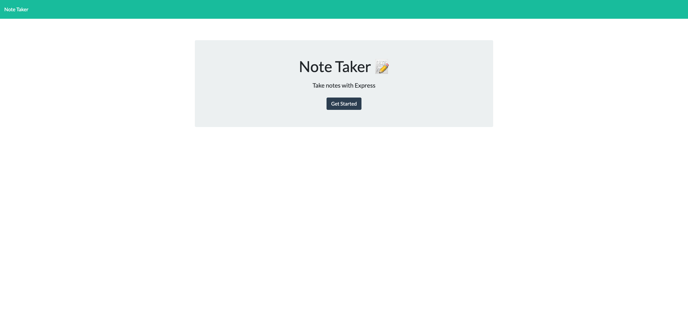
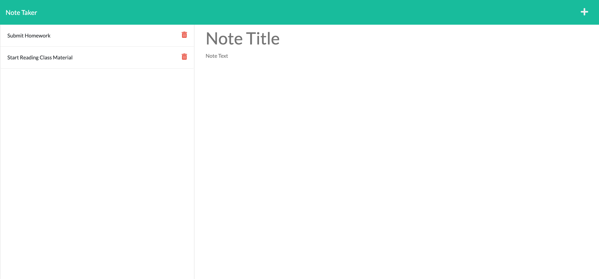
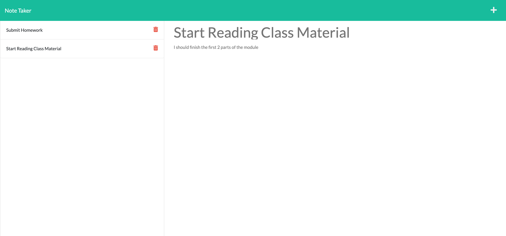

# MyNotes 
 
 ## Description
This Repository contains code for Rutgers Coding Bootcamp's Challenge 11 "Express.js Challenge: Note Taker". 

For this This week's challenge, we were tasked to create an application called that can be used to write and save notes.

The application will be using Express.js for the back end and will save and retrieve note data from a JSON file.

### [CLICK HERE TO VISIT THE DEPLOYED APP](https://mynotes-rromero.herokuapp.com/)

 ## Table Of Contents
  * [Description](#description)
  * [Screenshots](#screenshots)
  * [Installation](#installation)
  * [Usage](#usage)
  * [Contributing](#contributing)
  * [Questions](#questions)
  * [License](#license)

## Screenshots

Here are some screen shots of the app website:

 
## Installation

The app is already deployed and no installation is necessary! 

You can simply go to https://mynotes-rromero.herokuapp.com/ to start using it.

However, if you would wish to configure the code, please do the following:
1. Download and install Node.js from https://nodejs.org/en/download/

2. Clone the repository OR download the code from https://github.com/ronnieve23/MyNotes

3. Navigate to where you saved the downloaded/cloned repository; Right click on the repostiory folder (MyNotes) and select "New Terminal at folder". 

4. Inside the terminal, type "npm i" and hit enter. Wait for the installation to finish.

5. Open the repository inside VS Code to start editing.

## Usage
1. Click "Get Started" on the website's landing page.
2. Click on "Note Title" and start giving your note a title/
3. Click on "Note Tex" to start typing your note.
4. Click the Save Icon on the upper right corner to save your note!

## Contributing

 You can contribute to the development of the app by sending suggestions to Ronnieve_Romero@yahoo.com

 ## Questions 

  For any questions, please feel free to reach out to me at the following:

  Github: https://github.com/ronnieve23

  Email: Ronnieve_Romero@yahoo.com

 ## License

 

  The express package used in this app is licensed under the MIT license.

Permission is hereby granted, free of charge, to any person obtaining a copy
of this software and associated documentation files (the "Software"), to deal
in the Software without restriction, including without limitation the rights
to use, copy, modify, merge, publish, distribute, sublicense, and/or sell
copies of the Software, and to permit persons to whom the Software is
furnished to do so, subject to the following conditions:

The above copyright notice and this permission notice shall be included in all
copies or substantial portions of the Software.

THE SOFTWARE IS PROVIDED "AS IS", WITHOUT WARRANTY OF ANY KIND, EXPRESS OR
IMPLIED, INCLUDING BUT NOT LIMITED TO THE WARRANTIES OF MERCHANTABILITY,
FITNESS FOR A PARTICULAR PURPOSE AND NONINFRINGEMENT. IN NO EVENT SHALL THE
AUTHORS OR COPYRIGHT HOLDERS BE LIABLE FOR ANY CLAIM, DAMAGES OR OTHER
LIABILITY, WHETHER IN AN ACTION OF CONTRACT, TORT OR OTHERWISE, ARISING FROM,
OUT OF OR IN CONNECTION WITH THE SOFTWARE OR THE USE OR OTHER DEALINGS IN THE
SOFTWARE.